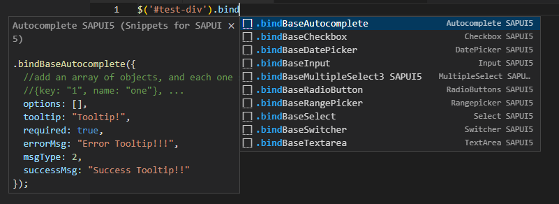

# Snippets for SAP UI5 - README

Un set de snippets para que puedas crear más rápidamente tus componentes de SAP UI5.



## ¿Cómo funciona?

Esta herramienta está pensado para un ambiente SAP, donde básicamente los componentes visuales ya están predefinidos y tan solo necesitamos instanciarlos rápidamente.

```javascript
$('#test-div').bindBaseCheckbox({
  id: 1,
  text: "Example Checkbox",
  onChange: (old, newValue) => {
    console.log(newValue);
  }
});
```

Al empezar a escribir, por ejemplo, `.bindBaseCheckBox` nos completará los elementos principales del componente **Checkbox**, según la documentación.

## Snippets

##### Fields

* `.bindBaseAutocomplete`
* `.bindBaseInput`
* `.bindBaseSelect`
* `.bindBaseMultiplSelect3`
* `.bindBaseDatePicker`
* `.bindBaseRangePicker`
* `.bindBaseCheckbox`
* `.bindBaseRadioButton`

##### Handlebars

* `.bindBaseSwitcher`
* `.bindBaseTextarea`

## Releases

Un resumen de las mejoras aportada con cada version:

### 0.0.1

Initial release, nothing new jeje.

## ¿Tienes alguna mejora o sugerencia?

Reporta los problemas *(Issues)* que encuentres [aqui](https://github.com/Pep3M/snippets-for-sapui5/issues "Issues"). Tambien escribe cualquier mejora o sugerencia. 

!Démosle a la comunidad una herramienta útil!

## Más información

* [Github Project](https://github.com/Pep3M/snippets-for-sapui5 "@Pep3M/snippets-for-sapui5") (don't forget this -> ⭐)
* [Contacto](mailto:pep3.marquez@gmail.com "Email") (Pep3 Marquez)
